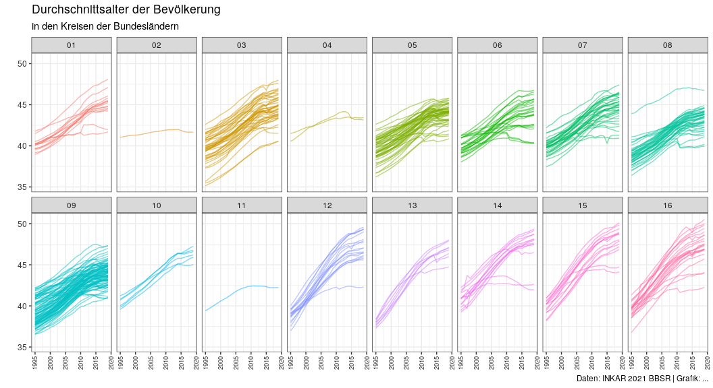

Untitled
================

## INKAR

``` r
library(tidyverse)
```

    ## ── Attaching packages ─────────────────────────────────────── tidyverse 1.3.2 ──
    ## ✔ ggplot2 3.3.6      ✔ purrr   0.3.4 
    ## ✔ tibble  3.1.8      ✔ dplyr   1.0.10
    ## ✔ tidyr   1.2.1      ✔ stringr 1.4.1 
    ## ✔ readr   2.1.2      ✔ forcats 0.5.2 
    ## ── Conflicts ────────────────────────────────────────── tidyverse_conflicts() ──
    ## ✖ dplyr::filter() masks stats::filter()
    ## ✖ dplyr::lag()    masks stats::lag()

``` r
library(glue)
library(vroom)
library(DBI)
library(duckdb)
```

``` r
packageVersion("duckdb")
```

    ## [1] '0.5.1'

### Read data from a parquet file via DuckDB

*Prepare connection*

``` r
# https://gist.github.com/cboettig/b1840f20996139d422ab497613dfdbde
conn <- DBI::dbConnect(duckdb(), ":memory:",
                       config=list("memory_limit"="2GB",
                                   "temp_directory" = "/tmp"))

DBI::dbExecute(conn, "INSTALL 'httpfs';")
```

    ## [1] 0

``` r
DBI::dbExecute(conn, "LOAD 'httpfs';")
```

    ## [1] 0

### Create query and get the data

``` r
q_parquet <- "https://raw.githubusercontent.com/patperu/inkar/master/data/inkar_2021.parquet"
q_ID <- 131 # Durchschnittsalter der Bevölkerung
q_Raumbezug <- "Kreise"

query <- glue_sql("
              SELECT *
              FROM {`q_parquet`}
              WHERE Raumbezug = {q_Raumbezug}
                  AND ID = {q_ID};
              ", .con = conn)

res <- DBI::dbGetQuery(conn, query) |> tibble()
```

    ## Rows: 10,025
    ## Columns: 9
    ## $ Bereich       <chr> "Bevölkerung", "Bevölkerung", "Bevölkerung", "Bevölkerun…
    ## $ ID            <dbl> 131, 131, 131, 131, 131, 131, 131, 131, 131, 131, 131, 1…
    ## $ Indikator     <chr> "Durchschnittsalter der Bevölkerung", "Durchschnittsalte…
    ## $ Raumbezug     <chr> "Kreise", "Kreise", "Kreise", "Kreise", "Kreise", "Kreis…
    ## $ Kennziffer    <dbl> 1001, 1001, 1001, 1001, 1001, 1001, 1001, 1001, 1001, 10…
    ## $ Kennziffer_EU <chr> NA, NA, NA, NA, NA, NA, NA, NA, NA, NA, NA, NA, NA, NA, …
    ## $ Name          <chr> "Flensburg, Stadt", "Flensburg, Stadt", "Flensburg, Stad…
    ## $ Zeitbezug     <chr> "1995", "1996", "1997", "1998", "1999", "2000", "2001", …
    ## $ Wert          <dbl> 40.22, 40.39, 40.56, 40.77, 40.93, 40.97, 41.03, 41.13, …

### Mean age of the population

``` r
res <- res |> 
  mutate(
    Kennziffer = str_pad(Kennziffer, width = 5, side = "left", pad = "0"), 
    Bundesland = str_sub(Kennziffer, 1, 2), 
    Zeitbezug = as.integer(Zeitbezug)
  )

res |> 
  ggplot(aes(x = Zeitbezug, y = Wert, group = Kennziffer, color = Bundesland)) +
  geom_line(alpha = 0.50, show.legend = FALSE) +
  facet_wrap(vars(Bundesland), nrow = 2) +
  
  theme_bw() + 
  labs(title = "Durchschnittsalter der Bevölkerung",
       subtitle = "in den Kreisen der Bundesländern",
       x = NULL,
       y = "",
       caption = "Daten: INKAR 2021 BBSR | Grafik: ...") + 
  theme(
    axis.text.y = element_text(color = "gray20", size = 9),
    axis.text.x = element_text(color = "gray20", angle = 90, vjust = 0.5, size = 7)
  ) 
```

<!-- -->

``` r
dbDisconnect(conn, shutdown=TRUE)
```
